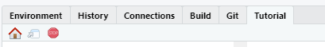

```{r setup, include=FALSE}
library(learnr)
library(shiny)
knitr::opts_chunk$set(echo = FALSE)

```

## Introduction

We'll be using Rstudio for statistical computation in this course. We will log onto the Rstudio server which lives on a computer at HCC. You can install R and Rstudio on your personal computer, if you'd like, but that is in another video.

## Video

[This is the video of me walk through this tutorial](https://youtu.be/G0H2mByoR0U)

## Log into the server

1.  Navigate your browser to: <http://hcc-rstudiosrv1.hcc.edu:8787/auth-sign-in>

2.  Use your \@hcc.edu email and password to log in. If you forgot your password the help desk phone number is: 413.552.2075

### example:

username: nschwab\@hcc.edu

password: \*\*\*\*\*\*\*\*

## Install tinytex()

### Attempt 1

Copy and paste into the console: `tinytex:::is_tinytex()` and hit enter - If the word TRUE shows, you are done, and you can close this and move on. - If FALSE go to the next step.

### Attempt 2

-   Copy and paste into the console: tinytex::install_tinytex() and hit enter You will see a bunch of red script-let it run until it stops.
-   At the top click Session \> Restart R
-   Copy and paste into the console: tinytex:::is_tinytex() and hit enter
    -   If the word TRUE shows, you are done, and you can close this and move on.
    -   If FALSE go to the next step

### Attempt 3

-   Copy and paste into the console: `install.packages("tinytex")` and hit enter\
    You will see a bunch of red script- let it run until it stops

-   At the top click Session \> Restart R

-   Copy and paste into the console: `tinytex:::is_tinytex()` and hit enter

    -   If the word TRUE shows, you are done, and you can close this and move on.

    -   If FALSE go to the next step

### Attempt 4

-   Click the little red power button in the upper right hand corner to end the session.

-   Then start a new session and type `tinytex:::is_tinytex()` if it says FALSE contact me.

## Load the tutorial libraries

Make sure you are running R 4.2.1 not R 4.1.1

Run these lines of code in the console:

`install.packages("remotes")`

`remotes::install_git("https://github.com/Nics-Github/MTH142Rtutorials")`

Press 3 to update no packages.

A bunch of code will run.

Go to the `session` menu and click `Restart R`

Type `library(MTH142Rtutorials)` to load the tutorials

## Tour of Rstudio

To help remember all of the things we need for this class, I've made a cheat sheet. Let's reference it to do the following:

-   Where are the `MTH142Rtutorials`? How do I run a tutorial

-   Make your first .Rmd

-   Keep yourself organized

-   Focus on the name of the file's spacing

-   Renaming a file

-   Downloading file from RStudio.

-   Uploading a file to Rstudio.

-   Copying and pasting plain text.

-   Taking a screen shot

## Console vs. Rmarkdown

-   Scratch work can be done in the console

-   Projects knit in markdown\*

\*Sometimes students get frustrated and complete the projects in a document with outputs from the console, that's ok you just lose a point. Totally worth it.

## Grey Chunk vs white space

-   Spacing in chunk

-   Chunk titles

-   Extra: Mosaic cheat sheets.

## Assignment

-   Make first knit .Rmd file.

-   Delete all the default stuff below the YAML.

-   Add a chunk to add some numbers together.

-   Write a sentence about what you hope to learn or accomplish in this class.

-   Save it as your_name_tut_1.Rmd

-   Knit your markdown file as .pdf and post it to the 1st R tutorial forum.

## Stop this tutorial when done

Don't forget to stop this tutorial. You can

-   Use the little stop sign in the "background jobs" tab.


-   Use the little stop sign in the "tutorial tab"


